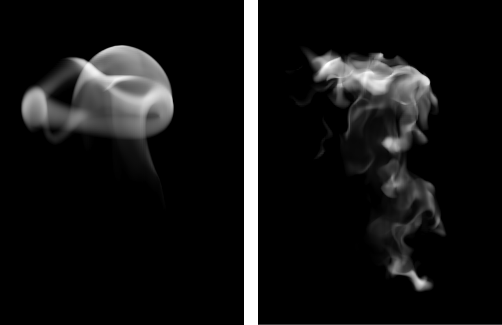

## The Characteristic Map for 
## Fast and Efficient VFX Fluid Simulations

Jerry Tessendorf, Brandon Pelfrey, 2011

<!-- 
いわゆるFlow Mapを導入した論文。この時点ではFlow Mapという名前は使っていない。
この論文はどこかのワークショップのために書かれたものなのでジャーナルとかに載っていない
-->

---

## 概要

速度場 $u(x,t)$ から **Characteristic Map（CM）** を計算し、密度場 $\rho(x,t)$ を **後段で再構成**する枠組み

CMは「密度そのもの」ではなく「流れの写像」を保持するため、後処理の自由度が高い

目的：
* シミュレーションを高解像度で回すのはコストが高い
* 低解像度・大きい $\Delta t$ でも、見た目を成立させたい
* ショットごとに後段で流れの詳細を編集したい

---

## 記号

* 位置 $x\in\mathbb{R}^3$、時刻 $t$
* 速度場 $u(x,t)$
* 密度 $\rho(x,t)$、初期密度 $\rho_0(x)$
* ソース（生成/消滅）$S(x,t)$
* 発散 $Q(x,t)=\nabla\cdot u(x,t)$
* Characteristic Map（CM）$X(x,t,s)$
* 圧縮性での指数因子 $T(x,t,s)$

---
layout: image-right
image: ./images/cm_flow.png
backgroundSize: 90%
---

## CM：密度ではなく「座標」を運ぶ

CM $X(x,t,s)$ は「時刻 $s$ の点が、時刻 $t$ にどう運ばれるか」を表す写像

> $s=0$ の時、$X(x,t,0)$ は「時刻 $t$ の位置 $x$ に来る粒子の初期位置」を返す

密度は「いまの点 $x$ の値」を直接更新するのではなく、参照位置 $X$ を通じて
$\rho_0$（初期密度）や $S$（注入ソース）を評価して再構成する

---
layout: image
image: ./images/fig1.png
backgroundSize: 95%
---

---

## 非圧縮：連続の式（支配方程式）

非圧縮の場合の密度輸送：

$$
\frac{\partial \rho}{\partial t} + u\cdot\nabla \rho = S(x,t)
$$

密度 $\rho$ が速度 $u$ に沿って運ばれ、さらにソース $S$ が足される。

---

## 非圧縮：CMを用いた密度の閉形式

CMを用いた密度：

$$
\rho(x,t)=\rho_0\left(X(x,t,0)\right)
+\int_0^t ds \, S\left(X(x,t,s), s\right)
$$

* 第1項：初期密度を、参照位置 $X(x,t,0)$ で読む
* 第2項：過去時刻 $s$ での注入 $S$ を、参照位置 $X(x,t,s)$ に沿って積分する

---

## 圧縮性：連続の式（発散項が追加される）

圧縮性（$\nabla\cdot u\neq 0$）では

$$
\frac{\partial \rho}{\partial t}
+ u\cdot\nabla \rho
+ (\nabla\cdot u)\rho
= S(x,t)
$$

となり、発散が密度の増減（圧縮・膨張）として働く。

ここで $Q(x,t)=\nabla\cdot u(x,t)$ を導入する。

---

## 圧縮性：指数因子 $T$ の導入

発散の効果は、参照経路に沿った指数因子として蓄積される：

$$
T(x,t,t_0)=
\exp \left\{
-\int_{t_0}^{t} ds \, Q\left(X(x,s,t_0), s\right)
\right\}
$$

この $T$ は「密度が参照経路に沿ってどれだけ減衰/増幅したか」を表す係数である。

---

## 圧縮性：密度の閉形式

圧縮性の解：

$$
\rho(x,t)
=
T(x,t,0)\rho_0\left(X(x,t,0)\right)
+
\int_0^t ds \,
T(x,t,s)S\left(X(x,t,s), s\right)
$$

* 初期密度にもソースにも同じく $T$ が掛かる点が重要
* 実用的には、発散が大きい領域をclampすることで安定性を保つ

---
layout: two-cols-header
---

## CMの編集力1：後段でのディテール注入

 

::left::

CM更新に使う速度を差し替えることで、\
シミュ本体を再計算せずに見た目を操作できる：

$$
u_{\mathrm{edit}}(x,t)=u(x,t)+u_{\mathrm{noise}}(x,t)
$$

$$
X(x,t+\Delta t,t_0)
=
X\left(x-u_{\mathrm{edit}}(x,t)\Delta t,t,t_0\right)
$$

ノイズ速度 $u_{\mathrm{noise}}$ を設計することで、渦度感・乱れ・スタイライズを付与できる

::right::

左：ノイズなし、右：ノイズあり

---

## CMの編集力2：流れの合成（CMブレンド）

CMは写像（あるいは変位）として扱えるため、線形ブレンドが自然に定義できる：

$$
X_{\mathrm{blend}}(x,t,s)=(1-\alpha)\,X_1(x,t,s)+\alpha\,X_2(x,t,s)
$$

* $\alpha$ を時間依存・空間依存にすると「特定領域だけ別の流れに寄せる」などが可能である
* ブレンド後は同様に $\rho_0(X_{\mathrm{blend}})$ やソース積分で再構成すればよい

---

## 実装手順

 

1. 速度場 $u(x,t)$ を用意する
2. CMグリッド $X(\cdot,t,0)$ を初期化：$X(x,0,0)=x$
3. 各ステップで $X$ を更新（Semi-Lagrangian）
4. 圧縮性の場合は $T$ も更新し、必要ならclampする
5. 最終的に密度を再構成
   * 非圧縮：$\rho=\rho_0(X)+\int S(X,s)\,ds$
   * 圧縮性：$\rho=T\,\rho_0(X)+\int T\,S(X,s)\,ds$

---

## 制限と発展

制限

* 写像を長時間更新すると一般に歪みが蓄積する
  * どこかで写像を「リセット（re-initialize）」する必要がある
  * ただリセットが急なボケや時間的不連続を生む
* 写像の更新自体は補間を伴うため、拡散がゼロになるわけではない

BiMOCQ（2019）

* **双方向マップ（forward / backward）** を保持することで、周期的な再初期化によるボケを回避
* 多段マップと誤差補正により、長時間でも低拡散な流体表現を実現

その他、Neural圧縮、自由表面対応、タイル分割、渦度保存、写像を粒子に持たせるなどの後続研究がある

---

## まとめ

 

* CMは「密度を運ぶ」代わりに「参照写像 $X$ を運ぶ」設計
* 非圧縮だけでなく、圧縮性流体も自然に扱える
* $X$（および $T$）は後段で編集しやすく、ノイズ注入・ブレンド等の制作操作に直結する

---

## 発展

* A Long-Term Semi-Lagrangian Method for Accurate Velocity Advection (SIGGRAPH Asia Tech. Briefs 2017)
* Spatially Adaptive Long-Term Semi-Lagrangian Method for Accurate Velocity Advection (Comput. Visual Media 2018)
* An Advection–Reflection Solver for Detail-Preserving Fluid Simulation (SIGGRAPH 2018)
* Efficient and Conservative Fluids Using Bidirectional Mapping (BiMOCQ) (ACM TOG 38(4), SIGGRAPH 2019)
* Tiled Characteristic Maps for Tracking Detailed Liquid Surfaces (CGF (SCA) 2022)
* Covector Fluids (ACM TOG 41(4), SIGGRAPH 2022)
* Fluid Simulation on Neural Flow Maps (ACM TOG 42(6), SIGGRAPH Asia 2023)
* Eulerian–Lagrangian Fluid Simulation on Particle Flow Maps (ACM TOG 43(4), SIGGRAPH 2024)
* Solid–Fluid Interaction on Particle Flow Maps (ACM TOG 43(6), 2024)
* Particle-Laden Fluid on Flow Maps (ACM TOG 43(6), 2024)
* Lagrangian Covector Fluid with Free Surface (ACM SIGGRAPH 2024)
* Leapfrog Flow Maps for Real-Time Fluid Simulation (ACM TOG 44(4), SIGGRAPH 2025)

