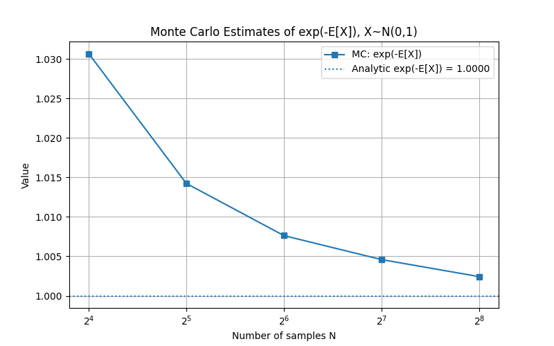

---
# try also 'default' to start simple
theme: default
# random image from a curated Unsplash collection by Anthony
# like them? see https://unsplash.com/collections/94734566/slidev
background: https://momentsingraphics.de/Media/SiggraphAsia2025/representative_image.jpg
# some information about your slides (markdown enabled)
title: Jackknife Transmittance

# apply UnoCSS classes to the current slide
class: text-center
# https://sli.dev/features/drawing
drawings:
  persist: false
# slide transition: https://sli.dev/guide/animations.html#slide-transitions
transition: fade-out
# enable MDC Syntax: https://sli.dev/features/mdc
mdc: true
hideInToc: true
---

# Jackknife Transmittance and MIS Weight Estimation

Christoph Peters, Delft University of Technology  
ACM Transactions on Graphics, 2025

<!--

-->

---

<Toc maxDepth="1"/>

---

# 前提：UnbiasedとConsistentの違い

///

### 不偏推定量(Unbiased Estimator)

$$
E[\hat{\theta}] - \theta = \epsilon
$$

> 推定量 $\hat{\theta}$ の期待値と真値 $\theta$ とのずれ $\epsilon$ を、推定量の偏り(bias)と呼ぶ。 
> $\epsilon$ がゼロの場合は、$\hat{\theta}$は不偏推定量(Unbiased Estimator)と呼ばれる。

 

### 一致推定量(Consistent Estimator)

$$
\lim_{N \to \infty} (\hat{\theta} - \theta) = 0
$$

> サンプル数を無限に増やしたときに、推定量が完全に真値に一致する場合、一致性(Consistency)を持つと言う。

---

### UnbiasedとConsistentの例

$$
\theta =\int_0^1 f(x) dx
$$

上の真値 $\theta$ を推定するために、$N$ 個のサンプル $x_i$ を用いて以下の推定量 $\hat{\theta}$ を考える。

||Unbiased|Biased|
|--|--|--|
|Consistent|$\hat{\theta}=\frac{1}{N} \Sigma_{i=1}^{N} f(x_i)$|$\hat{\theta}=\frac{1}{N} (\Sigma_{i=1}^{N} f(x_i) + A)$ $(\epsilon=\frac{A}{N})$|
|Inconsistent|$\hat{\theta}=\frac{1}{2}(f(x_1)+f(x_N))$|$\hat{\theta}=\frac{1}{N} \Sigma_{i=1}^{N} f(x_i)+ A$ $(\epsilon=A)$|

---
layout: image-right
image: https://mathlandscape.com/wp-content/uploads/2023/05/convex-func3.png
backgroundSize: contain
---

# 前提：Jensenの不等式

///

$g(x)$ が凸関数であるとき、確率変数 $X$ に対して以下の不等式が成り立つ。

$$
g(E[X]) \leq E[g(X)]
$$

凹関数の場合は不等式の向きが逆になる。つまり、非線形関数と期待値を入れ替えたときに一般に等号が成り立たない。

<!-- 
分散を一例にして導入するとイメージしやすいかも
 -->

---

# 前提：非線形関数はバイアスを生む

///

ある非線形関数 $g(x)$ があるとすると...

推定量 $\hat{\theta}$ がUnbiased $(E[\hat{\theta}] = \theta)$ であっても、それを非線形関数に入れた結果 $g(\hat{\theta})$ は 一般にUnbiasedではない $(E[g(\hat{\theta})] \neq g(\theta))$。

---

正規分布 $N(0,1)$ に従う確率変数 $X$ と、非線形関数の一例として $g(x) = \exp(-x)$ を考える。

<v-clicks>

$X$の平均を真値 $\theta = 0$ とし、$N$ 個のサンプル $x_i$ を平均すると不偏推定量 $\hat{\theta}$ が計算できる。

ここで、$\exp(-\theta) = \exp(0) = 1$であるが、$\exp(-\hat{\theta})$ を $N$ ごとにプロットすると、以下のようになる。

明らかに $N$ に依存するバイアスが存在する。ちなみに$N\to \infty$で真値に収束するので、一致性は満たす。

</v-clicks>

---

実際、非線形関数 $g(x)$ を真値の周りでテイラー展開を行うと、2次の項が $a/N$ のバイアスを生むことが分かる。

直観的には、非線形関数を通すことで分布が歪むことが原因と考えられる。

 

ちなみに今回使った関数 $g(x) = \exp(-x)$ はボリュームレンダリングの透過率計算で出てくるので、今回の論文のモチベーションとなっている。

$$
\exp(-\int_0^s \sigma ds)
$$

---

# 前提：Jackknife法

///

このバイアスを取り除くために、Jackknife法を用いる。

---

# 前提：関与媒質の透過率計算

///

---

# ボリュームレンダリング

///

ボリュームレンダリングで重要な2つの操作

| 操作                           | 内容              |
| ---------------------------- | --------------- |
| **距離（自由行程）サンプリング**        | 散乱・吸収が起きる位置を決める |
| **透過率推定** | 光がどれだけ届くかを求める   |

---

* $\mu(t)$：位置ごとの消散係数（extinction coefficient）
* $\tau$：光学的深度 (optical depth)

として、透過率は以下の式で定義される。

$$
T = \exp(-\tau), \quad \text{where} \quad \tau := \int_0^{t_{max}} \mu(t) dt
$$

---

# ジャックナイフ透過率推定値

///

光学的深さの推定値 $X_0, X_1$ が ほぼ正規分布するという仮定を置く。
（ストラタム分割＋ジッター付きサンプリングでそうなる）

統計学の「一般化ジャックナイフ (generalized jackknife)」を用いると、以下の透過率推定式が得られる。

$$
T \approx \cos\left(\frac{X_0 - X_1}{2}\right) \exp\left(-\frac{X_0 + X_1}{2}\right)
$$

* 正規分布の仮定を満たす限りはUnbiased
* $\cos$項が「過大評価の補正」をしてくれる
* 2回の光学的深さ推定（$X_0, X_1$）だけで済むのでGPU向き
* バイアスは非常に小さく, 高速・安定

---

## 導出

